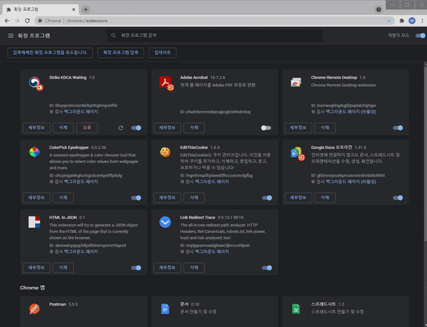

# strike-ncvr-kdca-go-kr
# Usage

1. `ncvr.kdca.go.kr` 대기열 확인

 

2. 크롬 확장 프로그램 설치

- `chrome://extensions` 접속

- 우측 상단 개발자 모드 ON

- 좌측 상단 "압축해제된 확장 프로그램을 로드합니다."

- html, js가 보이는 폴더까지 진입

 

3. 다시 돌아가서 대기열 확인

---

## 🧪 이 프로젝트는 연구 목적에 의해 만들어졌습니다.

- 해당 레포지토리는 `Netfunnel` 모듈이 가진 기능을 자동으로 우회할 수 있는지에 대한 검증을 위해 작성된 개념증명코드 입니다.

